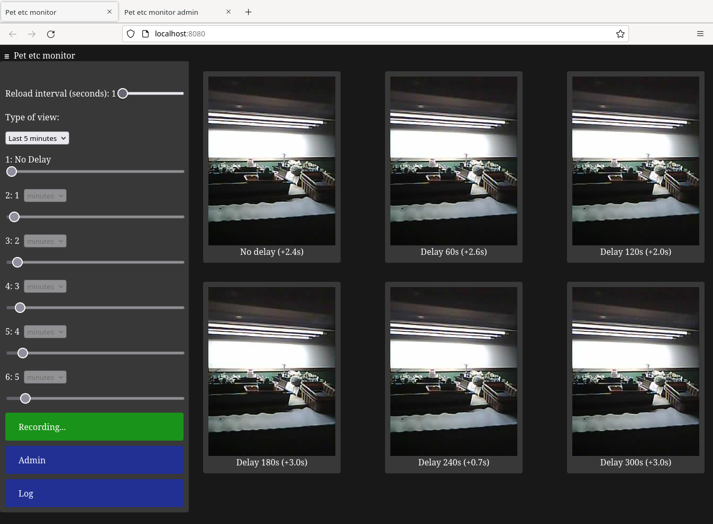

# pet-etc-monitor: An application for monitoring from cheap ESP32 CAM camera boards

This `pet-etc-monitor` application is written largely in Python using
[Flask](https://flask.palletsprojects.com/) to make more effective use
of the cheap and ubiquitous *ESP32 CAM* Wi-Fi enabled camera
boards. See <http://www.ai-thinker.com/pro_view-24.html> for the
*ESP32 CAM* datasheet.  These camera boards (or their clones) are
available for less than $10 from some sources such as
[AliExpress](https://www.aliexpress.com/).

When monitoring a pet with an *ESP32 CAM*, it was found that while
using the firmware from examples for the [Arudino
IDE](https://docs.arduino.cc/software/ide-v2) that the video streaming
is unreliable and often freezes up.  It was often hard to tell if an
image was frozen or not.

Features of this application include:

- Show images as they come in.  The *ESP32 CAM* is often seconds per
  frame so this is not a significant drawback for simple monitoring.
- Show multiple images, some with a user configured delay so what
  happened at past times can easily be compared to the present.
- Show warnings (through colour change) when images are unexpectedly
  delayed.
- Stores images on disk with metadata in a
  [PostgreSQL](https://www.postgresql.org/) database for future
  examination.

**Monitoring plants to make sure the cat doesn't get into them**

# ESP32 CAM hardware and firmware

This application currently uses as firmware the *ESP32 CAM* examples
for the [Arudino IDE](https://docs.arduino.cc/software/ide-v2).

- Install the *ESP32 board manager* according to the instructions at
<https://docs.espressif.com/projects/arduino-esp32/en/latest/installing.html>.

- After switching to `AI Thinker ESP32-CAM` under
*Tools-->Boards-->esp32-->AI Thinker ESP32-CAM*, use the
`CameraWebServer` example will be located under the
*File-->Examples-->ESP32-->Camera* menu.

- This can then be uploaded to the *ESP32 Cam* camera board using the
  usual procedure for the [Arudino
  IDE](https://docs.arduino.cc/software/ide-v2).

## IP address of the camera

A router that reserves an IP address for the *ESP32 Cam* can be used.

# Installation

This application consists of a recording application and a viewing
application.  Both have a browser-based interface and through
appropriate configuration these can be on different systems.  This
application has been tested on a Debian Linux 12 system.

## Installing a Python virtual environment

On Debian 12 the packages corresponding to the following command
probably need to be installed

`sudo apt-get install python3 python3-venv`

To install and use a virtual environment in the project directory,
follow the instructions on the Flask website
https://flask.palletsprojects.com/en/2.3.x/installation/.

Some commands to build (or rebuild) the default virtual environement are:

`
python3 -m venv ./venv
source venv/bin/activate
pip3 install -r requirements.txt
`

## Configuration

The application is configured through the `config_test.json` file.

In the `config_test.json` file the address and port of both the
recording application and viewing application can be configured.  The
rotation angle in degrees of the images of the camera can be
configured too.

### Creating the database and table

Create a [PostgreSQL](https://www.postgresql.org/) database following
the instructions for your operating system and
[PostgreSQL](https://www.postgresql.org/).  This package was developed
on Debian 12 so the instructions at https://wiki.debian.org/PostgreSql
work well.

In `config_test.json` configure `POSTGRES_DBNAME`, `POSTGRES_USER`,
`POSTGRES_PORT`, `POSTGRES_HOSTNAME`, `POSTGRES_PW`,
`POSTGRES_IMAGE_TABLE`.  See the placeholders in the afformentioned
file for descriptions.

### Configuring the ESP32 Cam

In `config_test.json` add the IP address and/or URL of the *ESP32 Cam*
to `CAPTURE_URL`, `STATUS_URL`, and `CONTROL_URL`.

## Running the test servers

In the project directory with the appropriate virtual environment is
activated using `source venv/bin/activate`, run the following commands
each in their own terminal.

`./test_record_daemon.py`

`./test_control_app.py`

`./test_view_app.py`

The default URL for the viewing application is
<http://localhost:8080>.  The default URL for the recording
application is <http://localhost:8081>.  These can be configured
through `config_test.json`.  The database table can be deleted
(DROPed!!! Careful!!!) by running the command.

`./test_record_daemon.py --reset-database`

When first run the `test_record_daemon.py` script will create the
table specified in `config_test.json`.

Convienience scripts are also provided in `test_control_app.sh`,
`test_record_daemon.sh`, and `test_view_app.sh` that will restart the
relevant program on a signal.

## Running the test servers using WSGI

In the project directory with the appropriate virtual environment is
activated using `source venv/bin/activate`, run the following commands
each in their own terminal.

`./test_record_daemon.py`

`mod_wsgi-express start-server --port 8081 test_control_app.wsgi`

`mod_wsgi-express start-server --port 8080 test_view_app.wsgi`

As above, the default URL for the viewing application is
<http://localhost:8080>.  The default URL for the recording
application is <http://localhost:8081>.  These can be configured
through `config_wsgi.json`.

# Future Improvements

Things I would like to improve in this application.

- Greatly reduce the latency from camera to database to web browser.

- I am currently modifying the *ESP32 CAM* firmware to use
[MDNS](https://en.wikipedia.org/wiki/Multicast_DNS).

- Better inspection of past images.

- Better management of the database and disk space from the browser
  interface.

- Add https and logins to help secure the application.

- Add additional sensors such as a temperature sensor.

- Add controls for things like an LED to light up the scene.

- Add permissions for the recording app.
